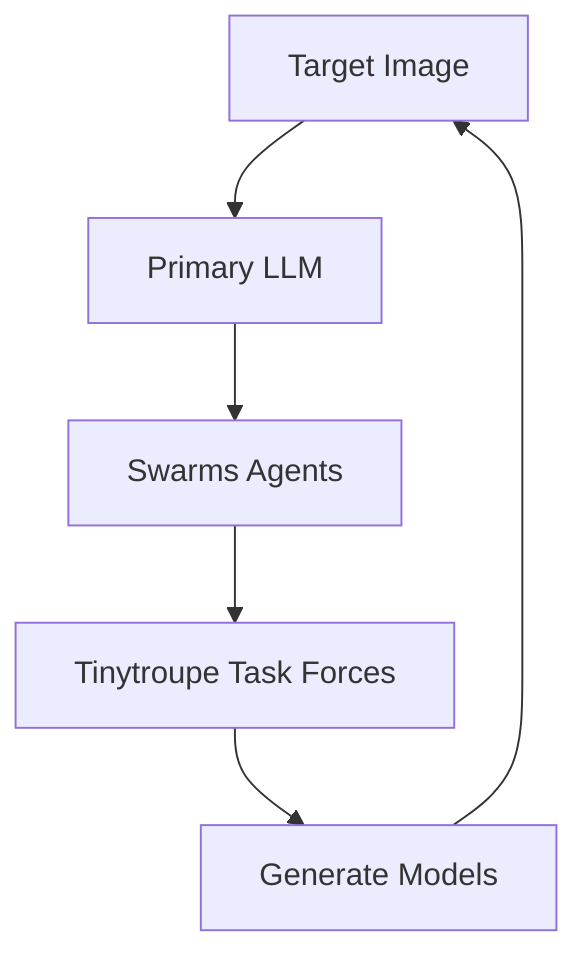
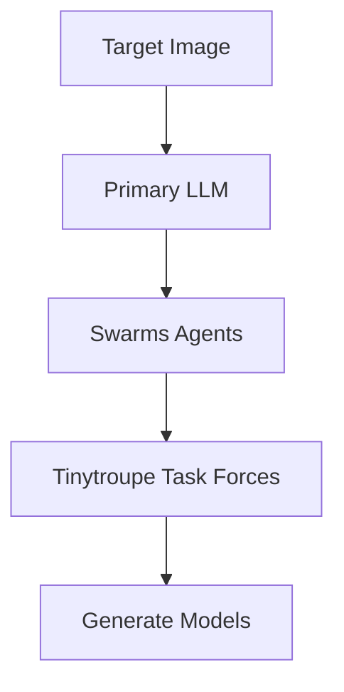

# TroupeSwarms: A TinyTroupe / Swarms Integration

Check back later for updates to this repository!  

The current outlined workflow of this subproject:

Note that a more linear approach may be taken:  

